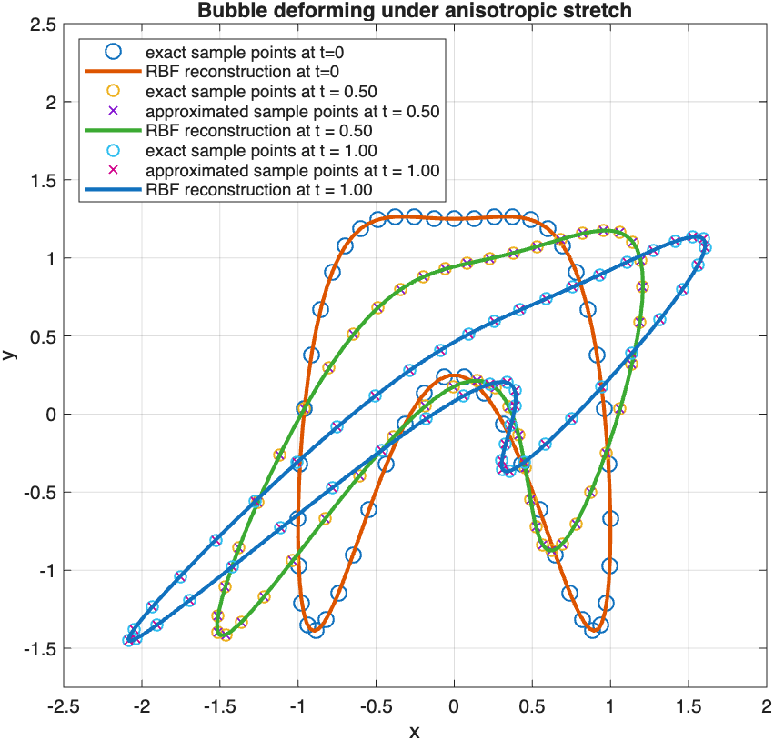
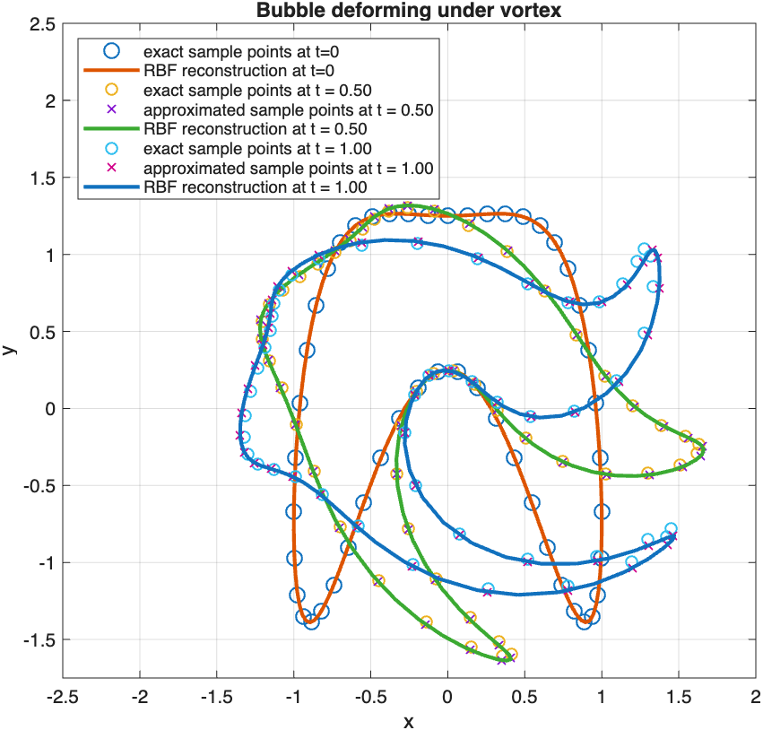

# Transforming and approximating parametric curves
A code repository for basic investigation of parametric curves: radial basis function approximation and transformations in time.

## Running this code
Open Matlab. Tested with Matlab R2025b. The most recent and generic version is in

```
>> main.m
```


## Overview of codes

### Main code
[main.m](src/main.m): radial basis functions in Cartesian coordinates, general transformations. This is the most general code and preferred starting point.
There are two important user inputs:
- [curve type](src/curves/parametric_curve.m): the type of initial curve. This can in principle be 'anything', and an interesting and useful example is the bubble.
- [transformation](src/transform.m): the type of transformation to be applied to the curve, where currently the options are 'rotation', 'translation'
'stretch','shear', 'rotation_translation', 'anisotropic_stretch', 'vortex'. These are all linear transformations, except 'vortex'.


### Other codes
- [rotating ellipse](src/rotating_ellipse_polar.m): radial basis functions in polar coordinates, rotation only. Polar coordinates suffer from only allowing star-shaped bubbles.
- [rotating cartesian](src/rotating_rbf_cartesian.m): radial basis functions in Cartesian coordinates, rotation only.

### Remarks
The choice of the RBF parameter $\varepsilon$ is important and determines the conditioning of the system.
In addition, the number of samples plays an important role in the quality of the reconstruction.
Last, the time integration method is currently set to Forward Euler, which is only first order in time.
However, for linear transformations, which are most of the available transformations, Forward Euler is exact.

## Example results

### Anisotropic stretch



### Vortex
